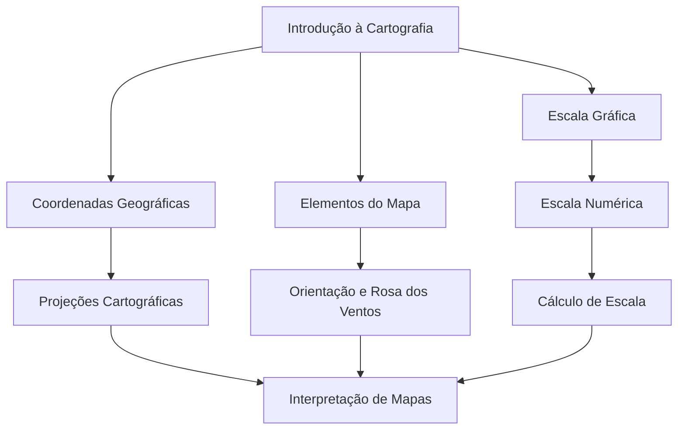

# ITS Cartografia — Documentação do Projeto

Sistema Tutor Inteligente (ITS) para ensino de **Cartografia**, com backend em Rasa Open Source, motor cognitivo em **Redes Bayesianas** (`pgmpy`) e agente conversacional baseado em **Academically Productive Talk (APT)**.

Repositório: [https://github.com/Robert0l/ITS-cartografia](https://github.com/Robert0l/ITS-cartografia)

---

## 1. Domínio de tutoria e grafo do domínio

### 1.1 Domínio escolhido

O ITS atua no domínio de **Cartografia**, conteúdo da disciplina de **Geografia** no ensino fundamental e médio. A escolha se justifica pela relevância do tema na formação escolar e na **cidadania**, pois mapas, coordenadas e escalas são ferramentas de localização e interpretação do espaço geográfico.

O tutor auxilia o estudante a desenvolver:

| Habilidade | Tópicos no sistema |
|------------|-------------------|
| **Localização** | Coordenadas geográficas (latitude/longitude), orientação e rosa dos ventos |
| **Compreensão de escalas** | Escala gráfica, escala numérica, cálculo de escala |
| **Interpretação de representações gráficas** | Elementos do mapa, projeções cartográficas, interpretação de mapas (incl. topográficos) |

A progressão de assuntos segue a estrutura didática do **capítulo 5** da obra *Conexões: Estudos de Geografia Geral e do Brasil* (Terra, Araújo e Guimarães, 2015).

### 1.2 Grafo do domínio (DAG)

O domínio é modelado como um **Grafo Acíclico Direcionado (DAG)**. Cada nó representa um conceito cartográfico; cada aresta indica que o conceito de origem é pré-requisito ou base para o conceito de destino.

**Nós (9 conceitos):**

| ID interno | Rótulo |
|------------|--------|
| `introducao` | Introdução à Cartografia |
| `coordenadas_geograficas` | Coordenadas Geográficas |
| `elementos_mapa` | Elementos do Mapa |
| `escala_grafica` | Escala Gráfica |
| `escala_numerica` | Escala Numérica |
| `calculo_escala` | Cálculo de Escala |
| `projecoes` | Projeções Cartográficas |
| `orientacao` | Orientação e Rosa dos Ventos |
| `interpretacao_mapa` | Interpretação de Mapas |

**Arestas (dependências):**

```
introducao → coordenadas_geograficas
introducao → elementos_mapa
introducao → escala_grafica
escala_grafica → escala_numerica
escala_numerica → calculo_escala
coordenadas_geograficas → projecoes
elementos_mapa → orientacao
projecoes → interpretacao_mapa
orientacao → interpretacao_mapa
calculo_escala → interpretacao_mapa
```

**Diagrama:**



A implementação está em `rasa/actions/bayesian_network.py`. Cada nó possui estados binários: **0 = não domina**, **1 = domina**. As **Tabelas de Probabilidade Condicional (CPT)** definem como o domínio em um conceito influencia a probabilidade de domínio nos conceitos dependentes — por exemplo, acertos consistentes em *Projeções Cartográficas* aumentam a probabilidade inferida de compreensão em *Interpretação de Mapas*.

---

## 2. Estratégia de atualização do modelo do aluno

O sistema **não** utiliza incremento fixo (como “+20% a cada interação”). A estratégia adotada é **Knowledge Tracing probabilístico com Redes Bayesianas**, alinhada ao requisito de modelagem por incerteza.

### 2.1 Prior inicial (antes de observações)

Nós sem pais (como `introducao`) iniciam com **35%** de probabilidade de domínio — o aluno não parte de zero absoluto, mas de uma crença neutra-levemente otimista.

### 2.2 Cold start — questionário de 10 perguntas

No primeiro contato, um formulário diagnóstico aplica **10 perguntas** mapeadas aos tópicos do grafo. Para cada tópico com respostas:

- Se **≥ 50%** das perguntas daquele tópico foram corretas → evidência **domina (1)**
- Caso contrário → evidência **não domina (0)**

Isso calibra o perfil inicial sem exigir interação prévia com o tutor.

### 2.3 Atualização contínua (durante o estudo)

A cada interação registrada pelo sistema:

| Evento | Efeito no modelo |
|--------|------------------|
| **Acerto** (`inform_correct_answer`, reflexão forte/parcial, confirmação “entendi”) | Evidência positiva no tópico ativo → domínio observado como 100% naquele nó |
| **Erro** | Evidência negativa → domínio observado como 0% naquele nó |
| **Erro em APT (escala)** | Penalidade **suave (−8%)** antes de converter em evidência, preservando diálogo reflexivo |
| **Tópicos sem evidência direta** | Probabilidade **inferida** pelos pais via CPT e eliminação de variáveis |

### 2.4 Propagação entre conceitos

Quando um tópico recebe evidência, os demais nós do grafo são recalculados. Exemplo: dominar `projecoes` eleva a probabilidade inferida em `interpretacao_mapa`, mesmo que o aluno ainda não tenha respondido sobre mapas topográficos.

### 2.5 Fontes de dados analíticas

As probabilidades são atualizadas com base em:

- **Acertos** e **erros** em exercícios e no questionário diagnóstico
- **Qualidade das reflexões** durante o estudo (análise textual: forte, parcial, fraca, equívoco)
- **Interações do chatbot** (intents, slots, tópico em foco)

O estado cognitivo é exposto ao frontend via JSON (`cognitive_state.mastery`, `focusedTopic`) a cada atualização.

---

## 3. Inspirações teóricas das funcionalidades

| Funcionalidade | Base teórica |
|----------------|--------------|
| **Domínio e sequência de conteúdos** | Didática de Terra, Araújo e Guimarães (2015), cap. 5 — *Conexões: Estudos de Geografia Geral e do Brasil* |
| **Knowledge Tracing** | Rastreamento probabilístico do estado cognitivo; questionário inicial de 10 itens para estimar domínio no primeiro contato |
| **Modelo do aluno** | Redes Bayesianas (DAG + CPT) para monitorar probabilidade de domínio ao longo do tempo |
| **Agente conversacional (CCA)** | Estratégias de **Academically Productive Talk (APT)**: perguntas reflexivas, diálogo produtivo, sem entregar a resposta imediatamente |
| **Avanço personalizado** | Modelos preditivos (inferência bayesiana) governam o tópico recomendado (`focusedTopic`) e o payload de domínio para o futuro mapa mental |

### Fluxos instrucionais inspirados em APT

1. **Diagnóstico inicial** — 10 perguntas para calibrar o perfil
2. **Estudo por tópico** — lição introdutória + pergunta reflexiva; o tutor avalia a resposta e só então aprofunda
3. **Erro em cálculo de escala** — pergunta reflexiva sobre a razão mapa–realidade, com penalidade leve no domínio
4. **Menu adaptativo** — após o diagnóstico, sugere o tópico de menor domínio estimado

---

## 4. Como rodar o projeto no Windows

### 4.1 Pré-requisitos

Instale antes de começar:

| Software | Versão mínima | Verificação (PowerShell) |
|----------|---------------|------------------------|
| **Git** | 2.x | `git --version` |
| **Docker Desktop** | 4.x (com Compose) | `docker --version` e `docker compose version` |
| **Python** (opcional, só para testes E2E) | 3.10+ | `python --version` |

Requisitos de hardware:

- **~4 GB de RAM livres** para treinar o modelo Rasa
- Portas **5005** (Rasa) e **5055** (Action Server) disponíveis

### 4.2 Clonar o repositório

Abra o **PowerShell** e execute:

```powershell
git clone https://github.com/Robert0l/ITS-cartografia.git
cd ITS-cartografia
```

### 4.3 Treinar o modelo Rasa (obrigatório na primeira execução)

O treino gera o modelo NLU/Core em `rasa/models/`. Sem este passo, o servidor Rasa não inicia.

```powershell
docker compose --profile train run --rm rasa-train
```

Aguarde a conclusão (pode levar alguns minutos na primeira vez). Ao final, deve existir um arquivo `.tar.gz` em `rasa/models/`.

### 4.4 Subir os serviços

```powershell
docker compose up --build
```

Serviços iniciados:

| Serviço | URL | Função |
|---------|-----|--------|
| **Rasa Server** | `http://localhost:5005` | NLU, diálogo, REST API |
| **Action Server** | `http://localhost:5055` | Custom Actions + Rede Bayesiana |

Para rodar em segundo plano:

```powershell
docker compose up --build -d
```

Para parar:

```powershell
docker compose down
```

### 4.5 Testar a API REST

```powershell
Invoke-RestMethod -Uri "http://localhost:5005/webhooks/rest/webhook" `
  -Method POST `
  -ContentType "application/json" `
  -Body '{"sender": "aluno_teste_1", "message": "olá"}'
```

Resposta esperada: mensagens de saudação e convite ao questionário diagnóstico.

### 4.6 Fluxo completo de uso (via chat)

1. Enviar **"olá"** → tutor convida ao diagnóstico
2. Enviar **"sim"** → inicia o formulário de 10 perguntas
3. Responder cada pergunta (letra A–D ou texto da opção)
4. Após a 10ª resposta → calibração da Rede Bayesiana e menu de tópicos
5. Enviar **"sim"** ou **"quero estudar escala gráfica"** → inicia estudo reflexivo (APT)
6. Payload `cognitive_state` aparece nas respostas JSON quando o domínio é atualizado

> Use um `sender` único por sessão de teste (ex.: `aluno_teste_1`). Reutilizar o mesmo `sender` mantém slots e estado do diagnóstico.

### 4.7 Executar testes automatizados

**Pré-requisito:** serviços rodando (`docker compose up -d`).

**Teste E2E (recomendado):**

```powershell
cd ITS-cartografia
python tests/run_continuation_e2e.py
```

**Teste com pytest (opcional):**

```powershell
pip install -r tests/requirements.txt
pytest tests/test_continuation_e2e.py -v
```

**Testes de diálogo Rasa (rules/policies):**

```powershell
docker compose --profile test run --rm rasa-test
```

### 4.8 Solução de problemas comuns

| Problema | Solução |
|----------|---------|
| Rasa não encontra modelo | Execute `docker compose --profile train run --rm rasa-train` |
| Porta 5005 em uso | Pare outro processo ou altere o mapeamento em `docker-compose.yml` |
| Action Server não responde | Verifique logs: `docker compose logs action-server` |
| Estado “preso” no diagnóstico | Use um novo `sender` na requisição REST |
| Erro de memória no treino | Feche outros programas; garanta ~4 GB RAM livres |
